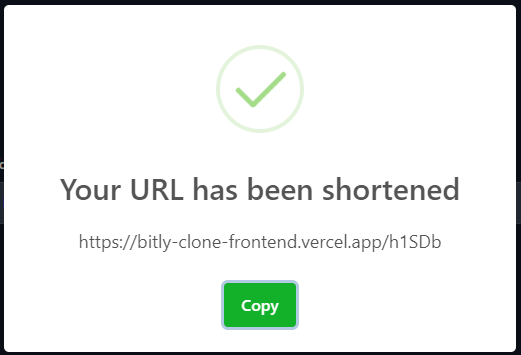

<p align="center"></p>
<h1 align="center">bitly-clone-frontend</h1>

- A url shortener which using Next.JS.

## Production Website

https://bitly-clone-frontend.vercel.app/

## Screenshot

home page


<hr/>

When you input a valid url.



<hr/>

When you input an invalid url.


## Getting Started

```bash
npm install
```

- rename `.env.example` to `.env`

edit file `.env`

- require https://github.com/Vjumpkung/bitly-clone-backend
- add [Backend](https://github.com/Vjumpkung/bitly-clone-backend) URL into `NEXT_PUBLIC_API_URL=`

```
NEXT_PUBLIC_API_URL=
```

First, run the development server:

```bash
npm run dev
```

Open [http://localhost:3000](http://localhost:3000) with your browser to see the result.